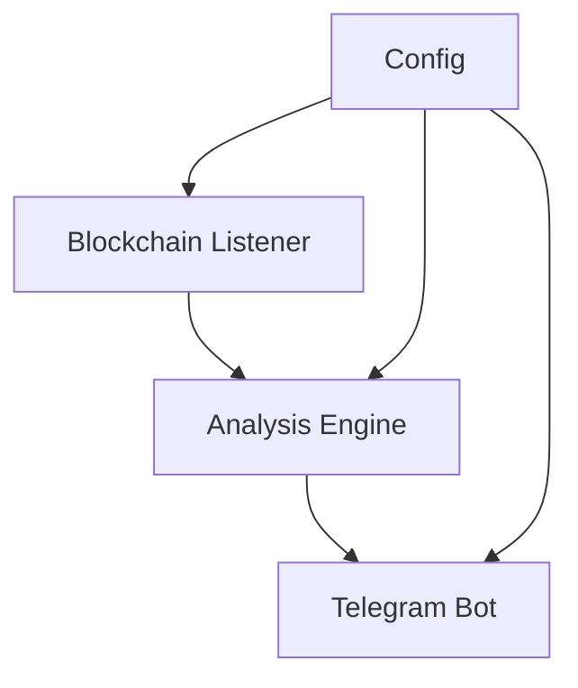

# 🤖 Trading Agent

A reliable trading bot for detecting and analyzing new token launches on BSC with minimal false positives.

## 🎯 Features
- Real-time blockchain event monitoring
- Token security analysis
- Telegram alerts and notifications
- Configurable analysis parameters

## 🚀 Quick Start

### Prerequisites
- Python 3.9+
- Screen or Tmux
- BSC Node URL
- Telegram Bot Token

### Installation
1. Clone the repository:
```bash
git clone https://github.com/tony-42069/trading-agent.git
cd trading-agent
```

2. Install dependencies:
```bash
pip install -r requirements.txt
```

3. Configure environment:
```bash
cp .env.example .env
# Edit .env with your API keys
```

4. Start the bot:
```bash
screen -S tradingbot
python run.py
# Ctrl+A+D to detach
```

## 📊 System Architecture


## 🔍 Monitoring
```bash
tail -f bot.log
```

## 🛠️ Development
Check out our [Technical Guide](docs/technical_guide.md) for detailed development information.

## 📝 Documentation
- [Project Manifest](docs/project_manifest.md)
- [Quickstart Guide](docs/quickstart_guide.md)
- [Technical Guide](docs/technical_guide.md)
- [Roadmap & Strategy](docs/roadmap_strategy.md)

## 📈 Success Metrics
- Detect new pairs
- <2 min detection delay
- <10% false positives
- Basic security flags

## 📄 License
MIT
