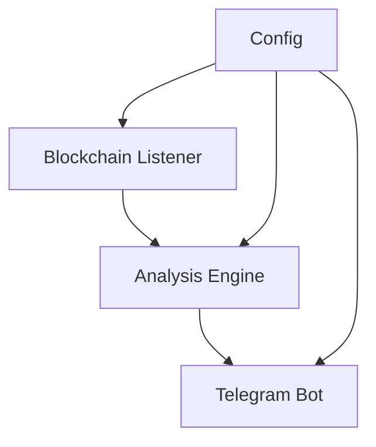
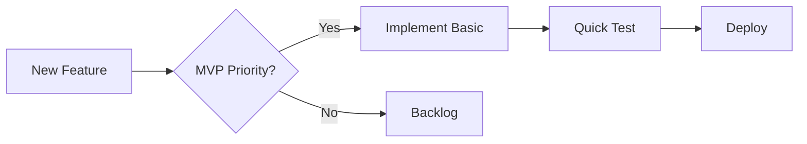

# :dart: Trading Bot MVP

## System Overview


## :key: Key Components & Entry Points
### Core Files
1. `src/bot.py`
   - Main Telegram bot interface
   - When to modify: Adding new commands/alerts
2. `src/scanner.py`
   - Blockchain event listener
   - When to modify: Changing monitoring criteria
3. `src/analyzer.py`
   - Token analysis logic
   - When to modify: Updating analysis rules
4. `config.py`
   - Configuration settings
   - When to modify: Adjusting thresholds/parameters
5. `run.py`
   - Application entry point
   - When to modify: Rarely, core startup logic

## :rocket: Essential Commands
```bash
# Install Dependencies
pip install -r requirements.txt

# Configure Environment
cp .env.example .env
# Edit .env with your API keys

# Start Bot
python run.py

# Deploy (Screen)
screen -S tradingbot
python run.py
# Ctrl+A+D to detach
```

## :books: Documentation Map
### For New Users
1. [Quickstart Guide](quickstart.md)
   - Installation & basic setup
   - Getting your first alerts

### For Developers
1. [Technical Guide](technical_guide.md)
   - System architecture
   - Component details
   - API reference

### For Project Managers
1. [Roadmap](roadmap.md)
   - MVP timeline
   - Feature roadmap
   - Success metrics

## :arrows_counterclockwise: Development Workflow


## :dart: Quick Reference
### Common Tasks
1. Adding New Alert Type
   - Modify `src/analyzer.py`
   - Update alert templates in `src/bot.py`
   - Update config thresholds

2. Adjusting Scan Criteria
   - Edit `config.py` thresholds
   - Test with small values first
   - Monitor for false positives