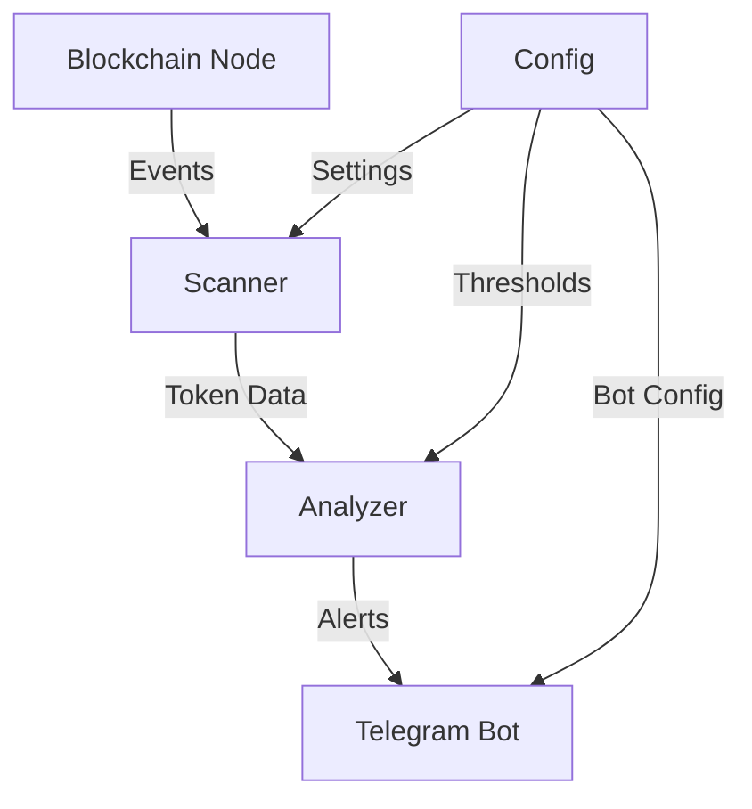

# :hammer_and_wrench: Technical Guide

## System Architecture
### Core Components


### Component Details
1. Scanner (`scanner.py`)
   - Listens for PairCreated events
   - Filters initial liquidity events
   - Queues tokens for analysis

2. Analyzer (`analyzer.py`)
   - Contract verification checks
   - Liquidity analysis
   - Market cap calculation
   - Initial holder analysis

3. Telegram Bot (`bot.py`)
   - Command processing
   - Alert formatting
   - User interaction

## Development Workflow
1. Fork repository
2. Create feature branch
3. Implement + basic test
4. Deploy to production
5. Monitor briefly
6. If issues, quick rollback

## API Integration
### Blockchain Node
```python
from web3 import Web3
web3 = Web3(Web3.HTTPProvider(NODE_URL))
```

### Telegram Bot
```python
from telegram.ext import Updater
updater = Updater(token=BOT_TOKEN)
```

## Deployment
1. Screen session:
```bash
screen -S tradingbot
python run.py
# Ctrl+A+D to detach
```

2. Basic process monitor:
```bash
while true; do
  python run.py
  sleep 5
done
```

## Quick Debug Guide
1. Check logs: `tail -f bot.log`
2. Verify node connection
3. Test Telegram connection
4. Check event listener